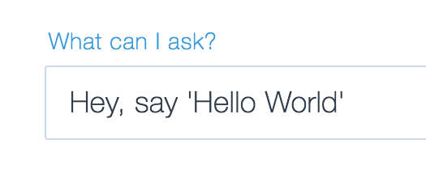
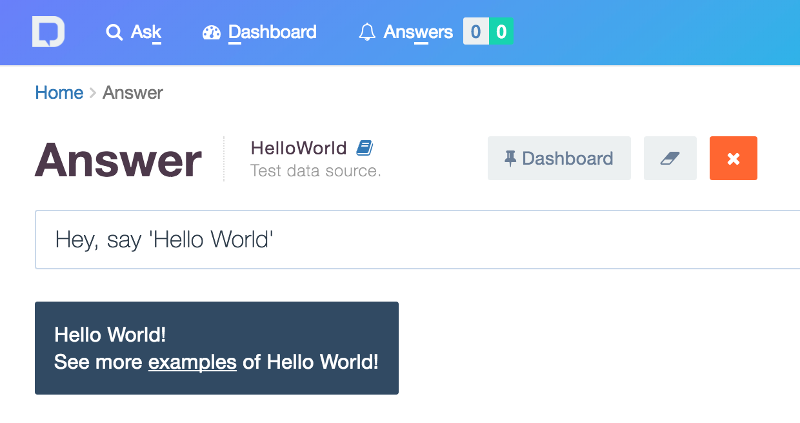

## Getting Started
Welcome to DataLingvo - the easiest way to built advanced natural language
interface to any device, data source or a service. 

This repo contains Java and Scala
examples of various data models from very simple (like `HelloWorld` example) to more 
complete ones (like `Weather` example). In this short tutorial you'll learn how to get up and running with a
simple example.

### Prerequisites
Here's the list of tools and basic skills that you will need to get started with DataLingvo:
 - DataLingvo uses Java and you need to have [Java SE Runtime Environment](http://www.oracle.com/technetwork/java/javase/downloads/index.html) (JRE) ver. 8 or later installed.
 - You'll need [Git]("https://git-scm.com/downloads) and [Maven](https://maven.apache.org/install.html) to be installed as well.
 
### Create Account
If you haven't done it already go ahead and [sign up](https://www.datalingvo.com/client/src/datalingvo.html#/signup)
with DataLingvo to create your **free account.** All newly created accounts automatically
get administrative privileges. When signing in for the first time you will get a message that you don't have 
any data sources - don't worry, we'll add one quickly.

### Get Company Probe Token
To configure your example you'll need a <b>secret probe token</b> that has been created and
associated with your company. Here's how to get it:
 - Go to [www.datalingvo.com](https://www.datalingvo.com) and [sign in](https://datalingvo.com/client/src/datalingvo.html#/signin).
 - Open up [Account](https://datalingvo.com/client/src/datalingvo.html#/account) page that can found by clicking on the avatar at the top right corner of your browser window.
 - Scroll down to the **Probe Token** section.
 - Click `Show Probe Token` button.</li>
 - Click `Copy` button to save your probe token into the clipboard. You should store it securely in a safe place.
 
### Clone This Project
Clone this project to a local folder:
```shell
$ mkdir datalingvo
$ cd datalingvo
$ git clone https://github.com/aradzinski/datalingvo-examples.git
```
### Run 'HelloWorld' Data Probe
We are going to use **HelloWorld** example from example project, located in `com.datalingvo.examples.helloworld` package, that simply answers 'Hello World' for any user questions. 

Note that you can run **HelloWorld** data probe either from command line or by creating Maven-based project in your favorite Java IDE (like <a target=_ href="https://www.jetbrains.com/idea/">IntelliJ IDEA</a> or <a target=_ href="https://eclipse.org/">Eclipse</a>).

#### Run From Command Line
First you need to build data probe from the source code. Go to the folder where you cloned the project and run the following command:
```shell
$ mvn clean package
```
You should see pretty lengthy Maven output and the success build output at the end:
```shell
[INFO] -------------------------------------------------
[INFO] BUILD SUCCESS
[INFO] -------------------------------------------------
[INFO] Total time: 6.285 s
[INFO] Finished at: 2017-04-05T09:47:27-07:00
[INFO] -------------------------------------------------
```
**NOTE**: if data probe build failed try to clear Maven local cache and re-run the command:
```shell
$ mvn dependency:purge-local-repository -DactTransitively=false -DreResolve=false --fail-at-end
$ mvn clean package
```
After data probe is successfully built you can start data probe using the following Maven command:
```shell
$ mvn exec:java@hello -DDATALINGVO_PROBE_TOKEN=XXX -DDATALINGVO_PROBE_ID=hello.probe.id
```
Where:
 * `hello` - name of the probe to start (you can also use `time`, `weather`, `chat`, `echo`, `robot`, or `whereami`).
 * `XXX` - probe token you obtained in the previous step.
 * `hello.probe.id` - arbitrary user-defined probe ID.
 
#### Run From Maven Project
To run **HelloWorld** data probe from the IDE project follow these steps:                     
 - Create Maven project based on `pom.xml` using your favorite Java IDE.
 - Create **Run Configuration** for `HelloWorldProbeRunner` class.
 - Specify two system properties for that configuration:
   - `DATALINGVO_PROBE_TOKEN`=`your_probe_token` (see previous step)
   - `DATALINGVO_PROBE_ID`=`hello.world`
 - Run `HelloWorldProbeRunner` example.

Whether you started **HelloWorld** data probe from command line or using IDE project you should get the output that looks like this:
```shell
+--------------------------+
| Probe started [2.05 sec] |
+--------------------------+

04.06.2018 10:06:04 Down-link 'downlink.datalingvo.com:80' established.
04.06.2018 10:06:04 Up-link 'uplink.datalingvo.com:80' established.
``` 

That's all there is to start a local data probe with a specific data model.

### Adding Data Source
At this point you have a running local data probe that is connected to DataLingvo servers. All you have to do now is to add a data source in the [Admin Studio](https://datalingvo.com/client/src/datalingvo.html#/studio) and start asking questions:
 - Go back to [www.datalingvo.com](https://www.datalingvo.com) and open up [Admin Studio](https://datalingvo.com/client/src/datalingvo.html#/studio) (top navbar menu).
 - Navigate down to **Data Sources** and click `Add Data Source` button.
 - Set any **Name** and **Description** and select 'Hello World Example' model.
 - Click `Add` button.
 - **NOTE:** first data source will be automatically enabled and selected.
 
### Ask Questions
Everything's ready - just go head and start exploring:
 - Go to [home](https://datalingvo.com/client/src/datalingvo.html#/ask) page and ask the question: 


 - You should get the following answer: 


### Explore!
Now that you have the basic example running you can explore all other examples in the project. Configure and run them exactly the same way and head over to [Developers Guide](https://datalingvo.com/client/src/datalingvo.html#/devguide) for in-depth explanations.
 

